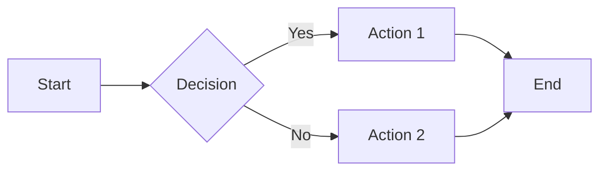

# Contract: Chapter Template

**Feature**: 001-ai-robotics-textbook
**Date**: 2025-12-05
**Phase**: 1 - Design & Contracts

## Purpose

This contract defines the standard structure and format for all textbook chapters, ensuring consistency, quality, and adherence to constitutional principles.

## Template File Structure

Every chapter follows this exact structure:

```markdown
---
id: chapter-id-slug
title: "Full Chapter Title"
sidebar_label: "Short Title"
sidebar_position: N
description: "Brief chapter summary for SEO and previews"
keywords:
  - keyword1
  - keyword2
  - keyword3
tags:
  - part-name
  - topic-category
---

# Full Chapter Title

## Overview

### What You'll Learn

By the end of this chapter, you will be able to:

- **Learning objective 1**: Specific, measurable outcome
- **Learning objective 2**: Another concrete skill or knowledge
- **Learning objective 3**: Third achievement goal
- **Learning objective 4**: Fourth outcome (if applicable)

### Prerequisites

Before starting this chapter, you should:

- ✅ Have completed [Chapter X: Title](../path/to/chapter.md)
- ✅ Understand [concept/technology name]
- ✅ Have [software/hardware] installed and configured

**Recommended Background**:
- [Optional prerequisite 1]
- [Optional prerequisite 2]

### Chapter Roadmap

This chapter is organized as follows:

1. **Background**: [Brief description of what this section covers]
2. **Core Concepts**: [Brief description]
3. **Implementation**: [Brief description]
4. **Lab Exercises**: [Brief description]
5. **Summary**: [Brief description]

**Estimated Time**: [X-Y hours] (Reading: [A] hours, Labs: [B] hours)

---

## Background

### [Subsection Title 1]

[Contextual information, historical development, or foundational knowledge]

[Text with clear explanations, avoiding unnecessary jargon]

**Key Point**: [Highlighted important information]

### [Subsection Title 2]

[More background information]

**Example**: [Real-world example or analogy]

### Why This Matters

[Explain the practical importance and applications]

[Connect to broader course themes]

---

## Core Concepts

### Concept 1: [Name]

#### Definition

[Clear, concise definition]

#### Explanation

[Detailed explanation with examples]

**Diagram**:

```mermaid
[Mermaid diagram if applicable]
```

*Figure X.Y: [Diagram caption with explanation]*

#### Key Characteristics

- **Characteristic 1**: Description
- **Characteristic 2**: Description
- **Characteristic 3**: Description

### Concept 2: [Name]

[Same structure as Concept 1]

### Concept 3: [Name]

[Same structure as Concept 1]

### Relationships Between Concepts

[Explain how these concepts connect and interact]

[Visual representation if helpful]

---

## Implementation

### Setup

#### System Requirements

**Hardware**:
- [Requirement 1]
- [Requirement 2]

**Software**:
- [Package 1 with version]
- [Package 2 with version]

#### Installation

```bash
# Install required packages
sudo apt update
sudo apt install package-name

# Verify installation
package-name --version
```

**Expected Output**:
```
package-name version X.Y.Z
```

### Tutorial 1: [Task Name]

#### Objective

[What this tutorial accomplishes]

#### Step 1: [Action]

[Detailed explanation of step]

```python
# Filename: example.py
"""
Brief description of what this code does.

ROS 2 Version: Humble
Dependencies: rclpy, std_msgs
"""

import rclpy
from rclpy.node import Node
from std_msgs.msg import String

class ExampleNode(Node):
    """
    A simple ROS 2 node demonstrating [concept].

    This node [explanation of functionality].
    """

    def __init__(self):
        super().__init__('example_node')

        # Create publisher
        self.publisher_ = self.create_publisher(String, 'topic', 10)

        # Create timer
        self.timer = self.create_timer(1.0, self.timer_callback)
        self.counter = 0

        self.get_logger().info('Example node initialized')

    def timer_callback(self):
        """Publish a message periodically."""
        msg = String()
        msg.data = f'Hello World: {self.counter}'
        self.publisher_.publish(msg)
        self.get_logger().info(f'Published: {msg.data}')
        self.counter += 1

def main(args=None):
    rclpy.init(args=args)
    node = ExampleNode()
    rclpy.spin(node)
    node.destroy_node()
    rclpy.shutdown()

if __name__ == '__main__':
    main()
```

**Code Explanation**:
- **Lines 1-7**: Import statements and module docstring
- **Lines 9-11**: Node class definition with docstring
- **Lines 13-21**: Node initialization, creates publisher and timer
- **Lines 23-28**: Callback function that publishes messages
- **Lines 30-36**: Main function that runs the node

#### Step 2: [Next Action]

[Explanation]

```bash
# Run the node
ros2 run package_name example_node
```

**Expected Output**:
```
[INFO] [timestamp] [example_node]: Example node initialized
[INFO] [timestamp] [example_node]: Published: Hello World: 0
[INFO] [timestamp] [example_node]: Published: Hello World: 1
```

#### Step 3: [Verification]

[How to verify it worked]

```bash
# In a new terminal, echo the topic
ros2 topic echo /topic
```

### Tutorial 2: [Another Task]

[Same structure as Tutorial 1]

### Common Issues and Troubleshooting

#### Issue 1: [Problem Description]

**Symptoms**:
- [Error message or behavior]

**Cause**:
- [Why this happens]

**Solution**:
```bash
# Fix command
command to fix
```

#### Issue 2: [Another Problem]

[Same structure]

### Best Practices

:::tip Best Practice
[Important recommendation with rationale]
:::

:::warning Common Mistake
[What to avoid and why]
:::

:::info Performance Note
[Optimization tip or performance consideration]
:::

---

## Lab Exercises

### Lab 1: [Exercise Title]

#### Difficulty
🟢 **Beginner** | 🟡 **Intermediate** | 🔴 **Advanced**

#### Estimated Time
[X-Y hours]

#### Objective
[What students will accomplish]

#### Setup Requirements

**Hardware**:
- [Required hardware]

**Software**:
- [Required packages]

**Files Needed**:
- Download: [Link to code examples]
- Starting template: [`template.py`](../../static/code-examples/path/template.py)

#### Instructions

**Part 1: [Subtask Name]**

1. [Step-by-step instruction]
2. [Next step]
3. [Verification step]

**Part 2: [Subtask Name]**

1. [Step-by-step instruction]
2. [Next step]

#### Deliverables

Submit the following:

- [ ] `filename.py` - [Description]
- [ ] Screenshot showing [specific output]
- [ ] Brief writeup (1-2 paragraphs) explaining [what you learned]

#### Validation Criteria

Your solution must:

- ✅ [Criterion 1 - must be objective and testable]
- ✅ [Criterion 2]
- ✅ [Criterion 3]

**Testing**:
```bash
# Run validation script
python validate_lab1.py your_solution.py
```

#### Hints

<details>
<summary>💡 Hint 1: [Topic]</summary>

[Helpful guidance without giving away the solution]

</details>

<details>
<summary>💡 Hint 2: [Topic]</summary>

[Another hint]

</details>

#### Extension Challenges

For advanced students:

- 🌟 **Challenge 1**: [Extra task]
- 🌟 **Challenge 2**: [Another advanced task]

### Lab 2: [Another Exercise]

[Same structure as Lab 1]

---

## Summary

### Key Takeaways

In this chapter, you learned:

1. **[Concept/Skill 1]**: [Brief recap]
2. **[Concept/Skill 2]**: [Brief recap]
3. **[Concept/Skill 3]**: [Brief recap]
4. **[Concept/Skill 4]**: [Brief recap]

### Connections to Other Topics

This chapter relates to:

- **[Previous Chapter X](../path/to/chapter.md)**: [How it connects]
- **[Future Chapter Y](../path/to/chapter.md)**: [What comes next]
- **[Related Topic](../path/to/chapter.md)**: [Cross-reference]

### Additional Resources

**Official Documentation**:
- [Resource 1 with link]
- [Resource 2 with link]

**Video Tutorials**:
- [Tutorial 1 with link]
- [Tutorial 2 with link]

**Community Resources**:
- [Forum/Discussion]
- [GitHub Repository]

**Research Papers** (optional):
- [Paper 1 citation and link]
- [Paper 2 citation and link]

### Self-Assessment

Test your understanding:

1. **Question 1**: [Conceptual question]
   <details>
   <summary>Show Answer</summary>
   [Answer with explanation]
   </details>

2. **Question 2**: [Practical question]
   <details>
   <summary>Show Answer</summary>
   [Answer with explanation]
   </details>

3. **Question 3**: [Application question]
   <details>
   <summary>Show Answer</summary>
   [Answer with explanation]
   </details>

### Next Steps

**Ready to Continue?**

If you've completed the labs and feel confident with the material, proceed to:

➡️ **[Chapter N+1: Title](../path/to/next-chapter.md)**

**Need More Practice?**

- Review the [Core Concepts](#core-concepts) section
- Try the [Extension Challenges](#extension-challenges)
- Join the [discussion forum] for questions

---

## Appendix: Code Reference

### Complete Code Listings

All code examples from this chapter:

- [`example1.py`](../../static/code-examples/chapter/example1.py)
- [`example2.xml`](../../static/code-examples/chapter/example2.xml)
- [`example3.yaml`](../../static/code-examples/chapter/example3.yaml)

### Dependencies Reference

```bash
# ROS 2 packages
sudo apt install ros-humble-package-name

# Python packages
pip3 install package-name==version
```

### Related ROS 2 Commands

```bash
# Useful commands for this chapter
ros2 command subcommand
ros2 topic list
ros2 node info /node_name
```

---

*This chapter is part of the [Physical AI & Humanoid Robotics Textbook](../../README.md), created using Claude Code and Spec-Kit Plus.*
```

## Template Requirements

### Frontmatter (YAML)

| Field | Type | Required | Description |
|-------|------|----------|-------------|
| `id` | string | Yes | Unique kebab-case identifier |
| `title` | string | Yes | Full chapter title (quoted) |
| `sidebar_label` | string | Yes | Short nav label (keep under 30 chars) |
| `sidebar_position` | number | Yes | Order in sidebar (1-27 for chapters) |
| `description` | string | Yes | 1-2 sentence summary for SEO |
| `keywords` | array | Yes | 3-5 relevant keywords |
| `tags` | array | Yes | Categorization tags |

### Section Requirements

#### 1. Overview Section

**Must Include**:
- "What You'll Learn" with 3-5 specific learning objectives
- "Prerequisites" with checklist of required knowledge/chapters
- "Chapter Roadmap" outlining section structure
- "Estimated Time" for reading and labs

**Learning Objectives Format**:
- Start with action verbs (understand, explain, implement, design, etc.)
- Be specific and measurable
- Align with Bloom's Taxonomy levels

#### 2. Background Section

**Must Include**:
- Contextual/historical information
- Foundational knowledge required for concepts
- Real-world relevance ("Why This Matters")

**Guidelines**:
- 500-1000 words
- No code examples (that's for Implementation)
- Use analogies and examples to explain complex ideas

#### 3. Core Concepts Section

**Must Include**:
- 3-5 major concepts with clear structure
- Definitions, explanations, diagrams
- Relationships between concepts

**Each Concept Needs**:
- Clear definition
- Detailed explanation
- Visual representation (Mermaid diagram or image)
- Key characteristics or properties

#### 4. Implementation Section

**Must Include**:
- Setup instructions (hardware/software requirements)
- 2-3 step-by-step tutorials
- Complete, runnable code examples
- Troubleshooting section
- Best practices with admonitions

**Code Example Requirements**:
- File header with description and dependencies
- Inline comments explaining key lines
- Code explanation block after listing
- Expected output shown
- Syntax highlighting with language tag

#### 5. Lab Exercises Section

**Must Include**:
- 1-3 hands-on exercises
- Clear difficulty indicators
- Deliverables and validation criteria
- Hints (in collapsible sections)
- Extension challenges for advanced students

**Each Lab Needs**:
- Difficulty level (Beginner/Intermediate/Advanced)
- Estimated time
- Objective statement
- Step-by-step instructions
- Objective validation criteria
- Optional hints and challenges

#### 6. Summary Section

**Must Include**:
- "Key Takeaways" (4-5 bullet recap)
- "Connections to Other Topics" (cross-references)
- "Additional Resources" (external links)
- "Self-Assessment" (3-5 questions with answers)
- "Next Steps" (navigation to next chapter)

### Content Standards

#### Writing Style

- **Tone**: Clear, technical, academically rigorous
- **Person**: Use "you" for direct instruction, "we" for joint exploration
- **Tense**: Present tense for facts, future for outcomes ("you will learn")
- **Terminology**: Define technical terms on first use, use consistently

#### Formatting

- **Headings**: Proper hierarchy (H2 → H3 → H4, no skipping)
- **Lists**: Parallel construction, consistent punctuation
- **Code**: Fenced blocks with language tags
- **Emphasis**: **Bold** for key terms, *italic* for emphasis
- **Links**: Descriptive text, not "click here"

#### Admonitions

Use Docusaurus admonitions for special content:

```markdown
:::note
General information or context
:::

:::tip Best Practice
Recommended approaches
:::

:::warning Common Mistake
What to avoid
:::

:::danger Safety Warning
Critical safety information (for hardware)
:::

:::info
Additional details or context
:::
```

### Code Example Standards

#### Python (ROS 2)

```python
#!/usr/bin/env python3
"""
Brief description.

ROS 2 Version: Humble
Dependencies: rclpy, package_name
"""

import rclpy
from rclpy.node import Node

class MyNode(Node):
    """Docstring explaining what this node does."""

    def __init__(self):
        super().__init__('node_name')
        # Initialization code
```

**Requirements**:
- Shebang line for executable scripts
- Module docstring with ROS version and dependencies
- Class docstrings
- Inline comments for complex logic
- Follow PEP 8 style guide

#### XML (URDF/Launch)

```xml
<?xml version="1.0"?>
<!-- Brief description of this file -->
<robot name="robot_name">

  <!-- Base link definition -->
  <link name="base_link">
    <visual>
      <!-- Visual geometry -->
    </visual>
  </link>

</robot>
```

**Requirements**:
- XML declaration
- File description comment
- Section comments for organization
- Proper indentation (2 spaces)

#### YAML (ROS 2 Parameters)

```yaml
# Node configuration for example_node
example_node:
  ros__parameters:
    # Publisher configuration
    topic_name: "/example_topic"
    publish_rate: 1.0

    # Node behavior
    enabled: true
```

**Requirements**:
- File description comment
- Section comments
- Consistent indentation (2 spaces)
- Descriptive parameter names

#### Bash (Scripts)

```bash
#!/bin/bash
# Brief description of script purpose

set -e  # Exit on error

# Function description
function setup_environment() {
    echo "Setting up environment..."
    # Commands
}

# Main execution
main() {
    setup_environment
}

main "$@"
```

**Requirements**:
- Shebang line
- Script description
- Error handling (`set -e`)
- Function comments
- Clear structure

### Diagram Standards

#### Mermaid Diagrams

**Supported Types**:
- Flowcharts (process flows)
- Sequence diagrams (interaction patterns)
- Class diagrams (software architecture)
- State diagrams (state machines)

**Example**:
```markdown

*Figure 5.1: Example decision flow showing...*
```

**Requirements**:
- Caption with figure number and explanation
- Clear labels and readable layout
- Alt text for accessibility (in caption)

#### Images

**When to Use**:
- Screenshots (RViz, Gazebo, Isaac Sim)
- Hardware photos
- Complex diagrams not suitable for Mermaid

**Requirements**:
- Stored in `static/img/`
- Optimized (< 200KB)
- Alt text required
- Caption with figure number

```markdown


*Figure 5.2: Caption explaining what the image shows*
```

### Accessibility Requirements

| Requirement | Implementation |
|-------------|----------------|
| Alt text | All images and diagrams |
| Heading hierarchy | Proper H2 → H3 → H4 |
| Link text | Descriptive, not "click here" |
| Code comments | Explain for all skill levels |
| Color contrast | Use theme defaults (WCAG 2.1 AA) |
| Keyboard navigation | Native Docusaurus support |

### Cross-Reference Guidelines

#### Internal Links

```markdown
[Chapter 5: ROS 2 Fundamentals](../02-ros2/05-fundamentals.md)
[Appendix A: ROS 2 Cheat Sheet](../08-appendix/a-ros2-cheatsheet.md)
```

**Requirements**:
- Relative paths from current file
- Descriptive link text including chapter/appendix title
- Verify links work before publishing

#### External Links

```markdown
[ROS 2 Documentation](https://docs.ros.org/en/humble/)
```

**Requirements**:
- HTTPS when available
- Link to stable versions (not "latest")
- Verify links are active

### File Naming Conventions

| Type | Pattern | Example |
|------|---------|---------|
| Chapters | `NN-description.md` | `05-fundamentals.md` |
| Part index | `index.md` | `index.md` |
| Code examples | `descriptive-name.ext` | `minimal-publisher.py` |
| Images | `chapter-description.ext` | `ros2-architecture.png` |

### Validation Checklist

Before publishing a chapter:

- [ ] Frontmatter complete and valid
- [ ] All 6 required sections present
- [ ] 3-5 learning objectives defined
- [ ] Prerequisites listed with links
- [ ] At least 1 lab exercise
- [ ] All code examples tested
- [ ] Code syntax highlighting correct
- [ ] Diagrams have captions and alt text
- [ ] Internal links verified
- [ ] External links verified
- [ ] Spelling and grammar checked
- [ ] Technical accuracy reviewed
- [ ] Tone consistent with constitution
- [ ] Estimated time realistic

### Chapter Length Guidelines

| Metric | Target | Range |
|--------|--------|-------|
| Word count | 3000-4000 | 2000-5000 |
| Code examples | 5 | 3-10 |
| Diagrams | 3 | 2-5 |
| Lab exercises | 1-2 | 1-3 |
| Reading time | 30-45 min | 20-60 min |
| Lab time | 1-2 hours | 0.5-3 hours |

## Usage Instructions

1. **Copy template** to `docs/[part]/[NN-chapter].md`
2. **Fill frontmatter** with chapter-specific metadata
3. **Replace placeholders** with actual content
4. **Add code examples** to `static/code-examples/`
5. **Create diagrams** using Mermaid or images
6. **Write lab exercises** with clear objectives
7. **Test all code** before including
8. **Review against checklist**
9. **Commit to feature branch**

## References

- [Docusaurus Markdown Features](https://docusaurus.io/docs/markdown-features)
- [Mermaid Diagram Syntax](https://mermaid.js.org/intro/)
- [WCAG 2.1 Guidelines](https://www.w3.org/WAI/WCAG21/quickref/)
- [Bloom's Taxonomy](https://cft.vanderbilt.edu/guides-sub-pages/blooms-taxonomy/)
