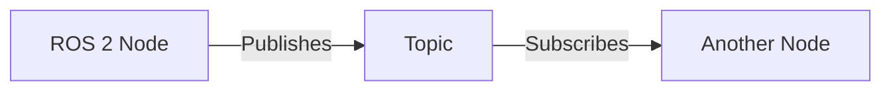

# Quickstart Guide: AI-Native Robotics Textbook

**Feature**: 001-ai-robotics-textbook
**Date**: 2025-12-05
**Phase**: 1 - Design & Contracts

## Overview

This quickstart guide helps contributors set up the development environment, understand the project structure, and start creating textbook content using the AI-native workflow.

## Prerequisites

- **Node.js**: 18.x or higher
- **npm**: 9.x or higher
- **Git**: 2.x or higher
- **Claude Code**: Latest version
- **Spec-Kit Plus**: Configured in the repository
- **Text Editor**: VS Code recommended

## Initial Setup

### 1. Clone the Repository

```bash
# Clone the repository
git clone https://github.com/<username>/ai_robotics_book.git
cd ai_robotics_book

# Checkout the feature branch (if working on existing feature)
git checkout 001-ai-robotics-textbook
```

### 2. Install Dependencies

```bash
# Install Node.js dependencies
npm install

# Verify installation
npm run docusaurus -- --version
```

**Expected Output**:
```
3.0.0
```

### 3. Start Development Server

```bash
# Start local development server
npm start
```

**Expected Behavior**:
- Server starts at `http://localhost:3000`
- Browser opens automatically
- Hot reload enabled (changes reflect immediately)

### 4. Verify Setup

Open `http://localhost:3000` and verify:
- [ ] Site loads without errors
- [ ] Sidebar navigation works
- [ ] Code syntax highlighting displays correctly
- [ ] Can navigate between pages

## Project Structure

```
ai_robotics_book/
├── docs/                    # All textbook content (Markdown)
│   ├── preface/            # Preface pages
│   ├── 01-physical-ai/     # Part I chapters
│   ├── 02-ros2/            # Part II chapters
│   ├── ...                 # Parts III-VII
│   └── 08-appendix/        # Appendices
│
├── specs/                   # Spec-Kit Plus artifacts
│   └── 001-ai-robotics-textbook/
│       ├── spec.md         # Feature specification
│       ├── plan.md         # Implementation plan
│       ├── research.md     # Technology research
│       ├── data-model.md   # Content entities
│       ├── quickstart.md   # This guide
│       ├── contracts/      # Design contracts
│       └── tasks.md        # Task breakdown (generated later)
│
├── static/                  # Static assets
│   ├── img/                # Images, diagrams
│   └── code-examples/      # Downloadable code samples
│
├── src/                     # Docusaurus customizations
│   ├── components/         # React components
│   ├── css/               # Custom styles
│   └── pages/             # Custom pages
│
├── .specify/               # Spec-Kit Plus configuration
│   ├── memory/
│   │   └── constitution.md # Project principles
│   ├── templates/          # Document templates
│   └── scripts/            # Automation scripts
│
├── history/                 # AI workflow artifacts
│   ├── prompts/            # Prompt History Records (PHRs)
│   │   ├── constitution/
│   │   ├── 001-ai-robotics-textbook/
│   │   └── general/
│   └── adr/                # Architecture Decision Records
│
├── docusaurus.config.js    # Docusaurus configuration
├── sidebars.js            # Navigation structure
├── package.json           # Node.js dependencies
└── README.md              # Project documentation
```

## AI-Native Workflow

### Overview of Spec-Kit Plus Commands

| Command | Purpose | When to Use |
|---------|---------|-------------|
| `/sp.specify` | Create feature specification | Starting new feature/chapter |
| `/sp.plan` | Generate implementation plan | After specification |
| `/sp.tasks` | Break down into tasks | After planning |
| `/sp.implement` | Execute tasks | Implementation phase |
| `/sp.analyze` | Quality checks | After content creation |
| `/sp.phr` | Create Prompt History Record | Document AI interactions |
| `/sp.adr` | Create Architecture Decision Record | Significant decisions |
| `/sp.git.commit_pr` | Commit and create PR | Ready to publish |

### Typical Content Creation Workflow

#### For a New Chapter

1. **Specification** (if not already done):
   ```
   /sp.specify Create Chapter N: [Title]
   ```
   - Claude generates specification based on requirements
   - Review and refine spec as needed

2. **Planning**:
   ```
   /sp.plan
   ```
   - Claude researches technology details
   - Generates data model and contracts
   - Creates implementation plan

3. **Tasking**:
   ```
   /sp.tasks
   ```
   - Claude breaks chapter into specific tasks
   - Tasks include: outline, draft sections, code examples, labs, review

4. **Implementation**:
   ```
   /sp.implement
   ```
   - Claude executes tasks sequentially
   - Creates chapter markdown file
   - Generates code examples
   - Writes lab exercises

5. **Quality Check**:
   ```
   /sp.analyze
   ```
   - Cross-artifact consistency check
   - Link validation
   - Constitution compliance

6. **Review & Commit**:
   - Manual review of generated content
   - Test code examples
   - Run: `/sp.git.commit_pr` when ready

## Creating Content Manually

If you prefer manual content creation or need to make quick edits:

### Adding a New Chapter

1. **Create Markdown File**:
   ```bash
   # Create file in appropriate part folder
   touch docs/02-ros2/05-fundamentals.md
   ```

2. **Copy Chapter Template**:
   - Reference: `specs/001-ai-robotics-textbook/contracts/chapter-template.md`
   - Include all required sections

3. **Add Frontmatter**:
   ```yaml
   ---
   id: 05-fundamentals
   title: "ROS 2 Fundamentals"
   sidebar_label: "Ch 5: Fundamentals"
   sidebar_position: 1
   description: "Introduction to ROS 2 architecture, nodes, topics, services, and actions"
   keywords:
     - ROS 2
     - robotics middleware
     - publish-subscribe
   tags:
     - ros2
     - fundamentals
   ---
   ```

4. **Write Content**:
   - Follow chapter template structure
   - Include all required sections
   - Add code examples with proper formatting

5. **Update Sidebar** (if new file):
   - Edit `sidebars.js`
   - Add document entry in correct position

6. **Test Locally**:
   ```bash
   npm start
   # Verify chapter appears and renders correctly
   ```

### Adding Code Examples

1. **Create Code File**:
   ```bash
   mkdir -p static/code-examples/ros2/nodes
   touch static/code-examples/ros2/nodes/minimal_publisher.py
   ```

2. **Write Code**:
   ```python
   #!/usr/bin/env python3
   """
   Minimal ROS 2 publisher example.

   ROS 2 Version: Humble
   Dependencies: rclpy, std_msgs
   """

   import rclpy
   from rclpy.node import Node
   from std_msgs.msg import String

   class MinimalPublisher(Node):
       def __init__(self):
           super().__init__('minimal_publisher')
           self.publisher_ = self.create_publisher(String, 'topic', 10)
           self.timer = self.create_timer(1.0, self.timer_callback)
           self.i = 0

       def timer_callback(self):
           msg = String()
           msg.data = f'Hello World: {self.i}'
           self.publisher_.publish(msg)
           self.get_logger().info(f'Publishing: {msg.data}')
           self.i += 1

   def main(args=None):
       rclpy.init(args=args)
       minimal_publisher = MinimalPublisher()
       rclpy.spin(minimal_publisher)
       minimal_publisher.destroy_node()
       rclpy.shutdown()

   if __name__ == '__main__':
       main()
   ```

3. **Reference in Chapter**:
   ````markdown
   Download the complete example: [`minimal_publisher.py`](../../static/code-examples/ros2/nodes/minimal_publisher.py)

   ```python
   # Code snippet or full listing
   ```
   ````

### Adding Diagrams

#### Mermaid Diagrams (Recommended)

````markdown


*Figure 5.1: Basic ROS 2 publish-subscribe pattern*
````

#### Image Diagrams

```markdown


*Figure 5.2: Complete ROS 2 system architecture*
```

**Image Requirements**:
- Optimize images (< 200KB)
- Use descriptive filenames
- Include alt text
- Add caption with figure number

## Development Workflow

### Daily Development Cycle

1. **Start Development Server**:
   ```bash
   npm start
   ```

2. **Make Changes**:
   - Edit markdown files in `docs/`
   - Add code examples to `static/code-examples/`
   - Save files (hot reload applies changes immediately)

3. **Review Changes**:
   - Check browser for rendering
   - Verify code syntax highlighting
   - Test navigation links

4. **Build Production Version**:
   ```bash
   npm run build
   npm run serve
   ```
   - Test production build locally
   - Ensure no broken links

5. **Commit Changes**:
   ```bash
   git add .
   git commit -m "Add Chapter 5: ROS 2 Fundamentals"
   git push origin 001-ai-robotics-textbook
   ```

### Testing Checklist

Before committing changes:

- [ ] `npm run build` succeeds without errors
- [ ] No broken links (Docusaurus checks at build time)
- [ ] All code examples have syntax highlighting
- [ ] Images load correctly
- [ ] Sidebar navigation works
- [ ] Breadcrumbs are correct
- [ ] Previous/Next navigation logical
- [ ] Mobile responsive (test on small screen)
- [ ] Spelling and grammar checked

## Common Tasks

### Preview Production Build

```bash
# Build static site
npm run build

# Serve production build locally
npm run serve
```

Access at `http://localhost:3000`

### Clear Cache

If you encounter build issues:

```bash
# Clear Docusaurus cache
npm run clear

# Reinstall dependencies
rm -rf node_modules package-lock.json
npm install
```

### Search Functionality

Search is configured via local search plugin.

To rebuild search index:
```bash
npm run build
# Index rebuilds automatically
```

### Add New Part

1. **Create Folder Structure**:
   ```bash
   mkdir -p docs/09-new-part
   touch docs/09-new-part/index.md
   ```

2. **Create Part Overview** (`index.md`):
   ```yaml
   ---
   id: index
   title: "Part IX: New Topic"
   sidebar_label: "Part Overview"
   sidebar_position: 0
   ---

   # Part IX: New Topic

   [Overview content]
   ```

3. **Add Chapters**:
   - Create chapter files: `NN-chapter-name.md`
   - Follow chapter template

4. **Update Sidebar**:
   - Edit `sidebars.js`
   - Add new category with chapters

5. **Update Constitution** (if principles change):
   - Edit `.specify/memory/constitution.md`
   - Document changes

### Deploy to GitHub Pages

Deployment is automated via GitHub Actions.

**Manual Deployment** (if needed):
```bash
# Configure deployment (one time)
npm run docusaurus deploy

# Subsequent deploys
GIT_USER=<username> npm run deploy
```

**Automated Deployment**:
- Push to `main` branch
- GitHub Actions builds and deploys automatically
- Site updates at `https://<username>.github.io/ai_robotics_book/`

## Troubleshooting

### Common Issues

#### Build Fails: "Cannot find module"

**Solution**:
```bash
rm -rf node_modules package-lock.json
npm install
```

#### Sidebar Not Updating

**Solution**:
```bash
npm run clear
npm start
```

#### Code Blocks Not Highlighting

**Cause**: Language not in `prism.additionalLanguages`

**Solution**: Edit `docusaurus.config.js`:
```javascript
prism: {
  additionalLanguages: ['python', 'bash', 'yaml', 'json', 'cpp', 'xml'],
}
```

#### Images Not Loading

**Cause**: Incorrect path

**Solution**: Use relative paths from current file:
```markdown

```

#### Hot Reload Not Working

**Solution**:
```bash
# Stop server (Ctrl+C)
npm run clear
npm start
```

### Getting Help

- **Docusaurus Docs**: https://docusaurus.io/docs
- **Project Constitution**: `.specify/memory/constitution.md`
- **Contracts**: `specs/001-ai-robotics-textbook/contracts/`
- **Claude Code Guide**: Ask Claude for help with Spec-Kit Plus commands

## Best Practices

### Content Quality

1. **Follow Templates**: Use chapter template consistently
2. **Test Code**: All runnable examples must be tested
3. **Accessibility**: Include alt text for all images
4. **Cross-Reference**: Link to related chapters
5. **Consistent Terminology**: Use terms from data model

### Performance

1. **Optimize Images**: Compress before adding
2. **Limit Bundle Size**: Avoid large dependencies
3. **Code Splitting**: Docusaurus handles automatically

### Version Control

1. **Atomic Commits**: One logical change per commit
2. **Descriptive Messages**: Explain what and why
3. **Feature Branches**: One branch per chapter/feature
4. **Pull Requests**: Review before merging to main

### AI-Native Workflow

1. **Document Decisions**: Use `/sp.adr` for significant choices
2. **Record Prompts**: Use `/sp.phr` after AI interactions
3. **Constitution Compliance**: Check against `.specify/memory/constitution.md`
4. **Iterative Refinement**: Generate → Review → Refine

## Next Steps

### For Content Authors

1. Review existing chapters in `docs/`
2. Read chapter template: `specs/001-ai-robotics-textbook/contracts/chapter-template.md`
3. Choose a chapter to work on
4. Use `/sp.specify` to create chapter spec
5. Follow AI-native workflow or create manually

### For Reviewers

1. Check content against constitution
2. Verify code examples run correctly
3. Test links and navigation
4. Review for technical accuracy
5. Provide feedback via GitHub issues or PR comments

### For Instructors

1. Review course alignment with textbook structure
2. Test lab exercises with students
3. Provide feedback on difficulty levels
4. Suggest improvements via issues

## Resources

### Documentation

- [Docusaurus](https://docusaurus.io/)
- [Markdown Guide](https://www.markdownguide.org/)
- [Mermaid Diagrams](https://mermaid.js.org/)
- [React MDX](https://mdxjs.com/)

### Project Files

- [Constitution](../.specify/memory/constitution.md)
- [Specification](./spec.md)
- [Implementation Plan](./plan.md)
- [Data Model](./data-model.md)

### Spec-Kit Plus Commands

- `/sp.specify` - Feature specification
- `/sp.plan` - Implementation planning
- `/sp.tasks` - Task breakdown
- `/sp.implement` - Execute tasks
- `/sp.analyze` - Quality checks
- `/sp.phr` - Prompt History Record
- `/sp.adr` - Architecture Decision Record
- `/sp.git.commit_pr` - Commit and PR

---

**Ready to get started?** Run `npm start` and begin creating content!
